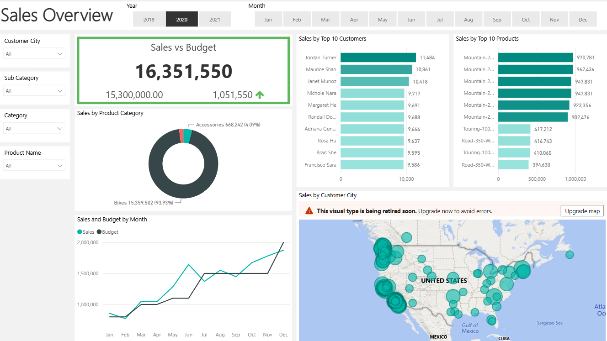
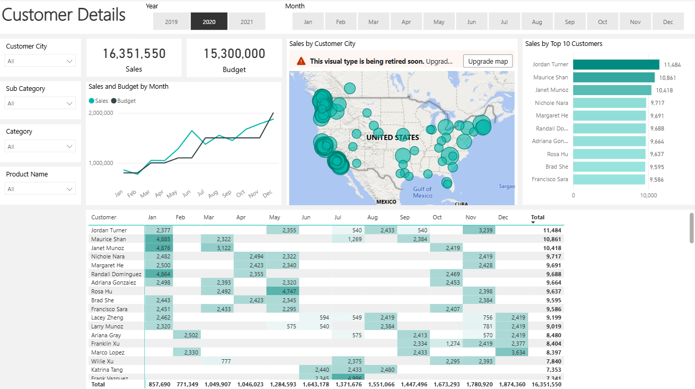
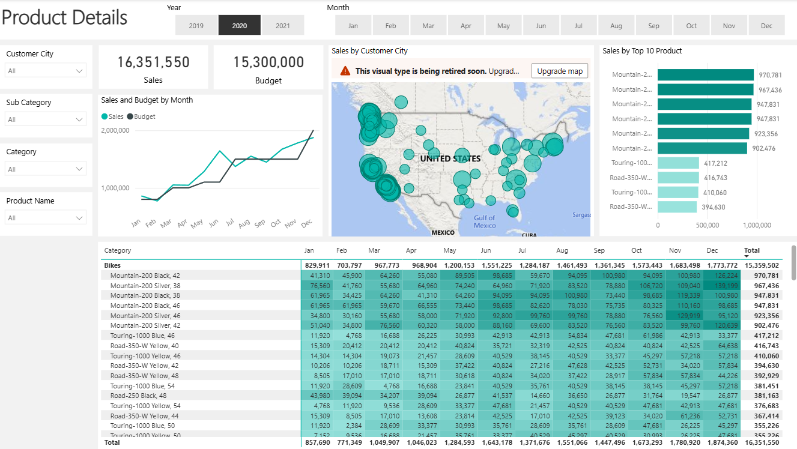
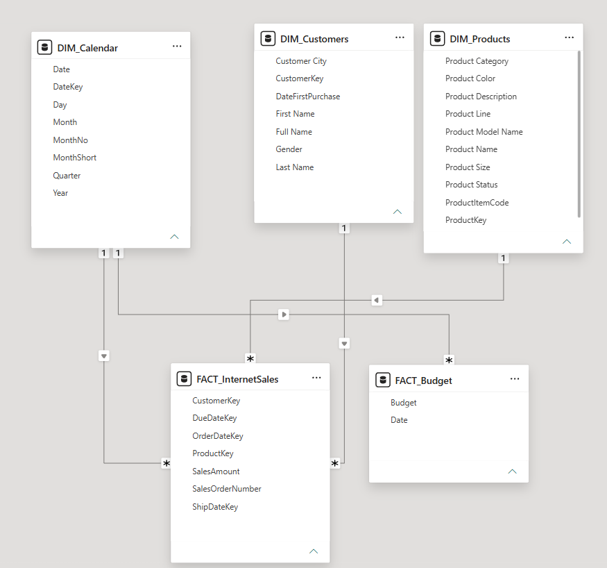

# Sales Report

**A sales analytics project built with Microsoft SQL Server and Power BI, combining dimensional data preparation, sales performance analysis, customer insights, product performance, and budget comparison in an interactive reporting solution.**

---

## Overview

This project analyzes sales performance using data extracted and prepared from the AdventureWorksDW2022 database with Microsoft SQL Server and visualized in Power BI.

The workflow includes:

- SQL-based extraction and cleansing of dimension and fact tables
- Customer, product, calendar, and internet sales data preparation
- Dimensional modeling in Power BI
- Sales vs. budget analysis
- Customer-level analysis
- Product-level analysis
- Interactive filtering and drill-down

**Tech Stack:**  
Microsoft SQL Server · T-SQL · Power BI · Power Query · DAX · Excel · Data Modeling

---

## Dashboard Preview

### Sales Overview



### Customer Details



### Product Details



---

## Data Model

The Power BI model connects sales transactions with customer, product, calendar, and budget data to support interactive analysis across multiple business dimensions.



---

## SQL Data Preparation

T-SQL was used to extract and prepare the main analytical tables from the AdventureWorksDW2022 database.

### Calendar Dimension

The calendar query prepares date attributes including:

- Date
- Day
- Week number
- Month
- Short month name
- Quarter
- Year

The extraction is restricted to records from 2019 onward.

[`DIM_Calendar_v2.sql`](sql/DIM_Calendar_v2.sql)

### Customer Dimension

The customer query prepares customer-level attributes and enriches the dataset by joining the geography table.

Selected fields include:

- Customer key
- First and last name
- Full name
- Gender
- First purchase date
- Customer city

[`DIM_Customer.sql`](sql/DIM_Customer.sql)

### Product Dimension

The product query combines product, product subcategory, and product category data.

The prepared dataset includes:

- Product name
- Product item code
- Product category
- Product subcategory
- Color
- Size
- Product line
- Model
- Description
- Product status

[`DIM_Products.sql`](sql/DIM_Products.sql)

### Internet Sales Fact Table

The fact query extracts core transaction-level sales information including:

- Product key
- Customer key
- Order date
- Due date
- Ship date
- Sales order number
- Sales amount

The query dynamically limits the extraction to the most recent two years of sales data.

[`FACT_InternetSales.sql`](sql/FACT_InternetSales.sql)

---

## Power BI Analysis

The prepared SQL outputs and sales budget data were loaded into Power BI and modeled for interactive reporting.

### Sales Overview

The overview page focuses on overall business performance and includes analysis of:

- Total sales
- Sales budget
- Sales vs. budget variance
- Monthly sales trends
- Customer performance
- Product performance
- Product category performance

### Customer Details

The customer analysis page enables deeper exploration of:

- Sales by customer
- Customer-level purchasing patterns
- Sales trends over time
- Geographic customer distribution
- Individual customer contribution to total sales

### Product Details

The product analysis page focuses on:

- Sales by product
- Product category and subcategory performance
- Product-level trends
- Best-performing products
- Product contribution to overall revenue

---

## Sales Budget

The project also includes a separate sales budget dataset used to compare actual sales performance against planned targets.

[`Sent Over Data - SalesBudget.xlsx`](data/Sent%20Over%20Data%20-%20SalesBudget.xlsx)

This enables the dashboard to highlight the relationship between:

**Actual Sales vs. Budgeted Sales**

---

## Source Data

The repository includes the prepared data extracts used in the Power BI model:

- [`DIM_Calendar.csv`](data/DIM_Calendar.csv)
- [`DIM_Customer.csv`](data/DIM_Customer.csv)
- [`DIM_Products.csv`](data/DIM_Products.csv)
- [`FACT_InternetSales.csv`](data/FACT_InternetSales.csv)
- [`Sent Over Data - SalesBudget.xlsx`](data/Sent%20Over%20Data%20-%20SalesBudget.xlsx)

---

## Power BI File

The complete interactive report is available here:

[`Sales Report_Finished.pbix`](powerbi/Sales%20Report_Finished.pbix)

---

## Repository Structure

```text
sales-report/
│
├── sql/
│   ├── DIM_Calendar_v2.sql
│   ├── DIM_Customer.sql
│   ├── DIM_Products.sql
│   └── FACT_InternetSales.sql
│
├── data/
│   ├── DIM_Calendar.csv
│   ├── DIM_Customer.csv
│   ├── DIM_Products.csv
│   ├── FACT_InternetSales.csv
│   └── Sent Over Data - SalesBudget.xlsx
│
├── powerbi/
│   └── Sales Report_Finished.pbix
│
├── images/
│   ├── powerbi_data_model.png
│   ├── sales_overview.png
│   ├── customer_details.png
│   └── product_details.png
│
└── README.md
```

---

## Summary

This project demonstrates a complete business intelligence workflow, starting with SQL-based data extraction and preparation and ending with an interactive Power BI reporting solution.

**SQL Server → Data Preparation → Dimensional Modeling → Power BI → Sales, Customer & Product Insights**
